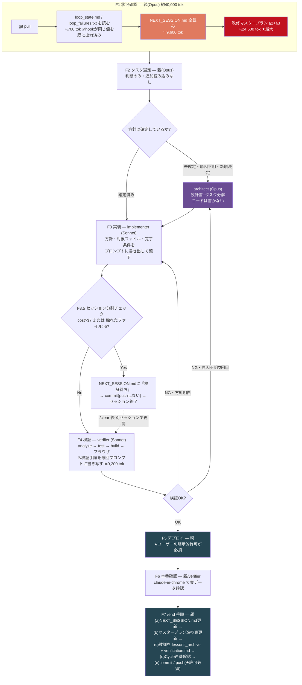

# トークン削減 調査報告書(2026-08-08)

対象: BeanBase 2.0 の日次改修ループ(`/start`・`/full_loop`・`/end` + サブエージェント運用)
調査方法: 上位モデル(Opus 5)が方針を決め、実測・Web調査・棚卸しの3件を下位モデル(Sonnet 5)へ並列委譲。実測データは `~/.claude/projects/-home-kzk-claude-bean-base/` 配下のセッションログ(直近2日・8セッション+サブエージェント7体)を機械集計。

---

## 0. 結論(先に3行)

1. **コストは「リクエスト数 × コンテキスト長 × モデル単価」でほぼ決まる**。実測でも1セッションだけ中央値18.6万トークンに膨らみ、そのセッション単独で推定コストの47%を占めていた。
2. **最大のレバーは「親セッションをSonnetに落とし、Opusはarchitectサブエージェントだけに使う」**。次が**検証の1コマンド化(`tools/verify.sh`の配線)によるリクエスト数削減**、その次が**毎ループの読み込みファイル削減**。
3. **ローカルLLMでのサブエージェント代替は見送り推奨**。Claude Codeにサブエージェント単位でモデルプロバイダを切り替える機能が存在せず(公式未実装)、代替できる工程(ログ要約)はgrep/スクリプトで十分かつ確実。

---

## 1. 前提の確認:定額プランでの「削減」とは何か

課金形態は**定額プラン(Max/Pro)**。したがって削減目標は「$」ではなく、**週次・5時間ごとの利用枠に当たる頻度を下げること**になる。

ここで重要なのは、利用枠の消費が**モデル単価で重み付けされる**点。公表APIレート(2026-08時点)は:

| モデル | 入力 $/MTok | 出力 $/MTok | キャッシュ書込 | キャッシュ読取 | コンテキスト |
|---|---:|---:|---:|---:|---:|
| Opus 5 | 5.00 | 25.00 | 6.25 (5分) | 0.50 | 1M |
| Sonnet 5 | 3.00(導入価格 2.00、2026-08-31まで) | 15.00(同 10.00) | 3.75 / 2.50 | 0.30 / 0.20 | 1M |
| Haiku 4.5 | 1.00 | 5.00 | 1.25 | 0.10 | 200K |

→ **同じトークン数でも Opus は Sonnet の約1.7倍(導入価格中は2.5倍)の枠を食う。** 「モデルを下げる」は、トークン数を1行も減らさずに効く唯一のレバー。

なお `CLAUDE.md` にある「200kトークン超で単価が約2倍」という記述は、**API従量課金のロングコンテキスト割増を前提にした古い理解**の可能性が高い。現行のOpus 5/Sonnet 5は1Mコンテキストが標準価格で、ロングコンテキスト割増の記載は公表価格表に無い。ただし**「コンテキストが長い=毎リクエストのキャッシュ読取が増える」という一次効果は実在する**ので、「長いセッションを避ける」という結論自体は正しい。理由の記述だけ後述の§4に差し替えるべき。

---

## 2. 実測:どこでトークンを使っているか

### 2.1 全体像(直近2日)

| 区分 | 実効入力(in+cache書込+cache読取) | 内訳 |
|---|---:|---|
| 親セッション(8本) | **約2,596万トークン** | うちキャッシュ読取 2,493万(96%)、キャッシュ書込 81.6万 |
| サブエージェント(7体) | **約1,496万トークン** | キャッシュ読取 1,365万、書込 131万、出力 12.5万 |
| 合計 | **約4,100万トークン / 2日** | ≒ 1ループ 1,000〜2,000万トークン |

**サブエージェントのログは親と別ディレクトリ(`<session-id>/subagents/*.jsonl`)にあり、最初の集計から漏れていた。**親の6割弱に相当する量が「見えないコスト」として発生している。ここは今後も計測対象に含めること。

### 2.2 セッション別のコンテキスト長

| セッション | モデル | リクエスト数 | 中央コンテキスト | 最大 | 200k超の割合 | 推定コスト |
|---|---|---:|---:|---:|---:|---:|
| 38df7cfd | Opus 5 | 43 | **186,248** | 208,775 | **27.9%** | **$6.62** |
| f2de366e | Sonnet 5 | 66 | 115,918 | 155,779 | 0% | $2.33 |
| 7b4975a7 | Sonnet 5 | 43 | 112,751 | 152,552 | 0% | $1.94 |
| 2c559315 | Sonnet 5 | 71 | 86,285 | 128,833 | 0% | $1.88 |
| その他4本 | 混在 | 計12 | 35k〜57k | 59,602 | 0% | 計$1.20 |

- **Opusで回した1セッションが、推定総額$13.97のうち$6.62(47%)を単独で占めた。**
- **リクエストあたりの最小コンテキストは28k〜52k**。これがシステムプロンプト+ツール定義+`CLAUDE.md`+メモリの「固定床」であり、全リクエストに毎回乗る。
- 想定と異なり、**`/full_loop` を回したセッションの一部がSonnetで動いていた**。モデル分担ルールと実態がずれている可能性があるので `/model` の実際の設定を確認したい。

### 2.3 入力を膨らませている要因(tool_result 文字数)

| ツール | 合計文字数 |
|---|---:|
| Read | 192,489 |
| Bash | 154,989 |
| その他8種 | 計 37,000 |

Read と Bash の2つで**tool_result全体の9割弱**。単発で最大のものは:

| 文字数 | 内容 |
|---:|---|
| 27,186 | `docs/改修マスタープラン.md` の全読み |
| 15,486 / 12,997 / 12,693 / 11,361 | `NEXT_SESSION.md` の全読み(4セッションで反復) |
| 13,344 | `rules/verification.md` の全読み |
| 21,331 | `export ANDROID_HOME=...` 系コマンドの出力 |

`NEXT_SESSION.md` は規約上「直近1セッション分のみ」を保つはずが、実際には1回のReadで**1万〜1.5万文字**を消費している。規約が守られていない。

### 2.4 サブエージェントも安くはない

今回この調査のために起動した3体のSonnetエージェント自身が、**1体あたり中央コンテキスト39万トークン**まで膨らんだ(集計スクリプトの出力やjsonlの断片を大量に抱え込んだため)。

> **「委譲すれば安い」は成立しない。** 委譲で確実に得られるのは (a) 親のコンテキストが伸びない (b) トークンが安いモデルに移る、の2点だけ。総トークン量はむしろ増えることがある。委譲先にも「出力を絞る」指示が要る。

---

## 3. `/full_loop` 手順の可視化

各手順に「実行主体」と「そこで発生する読み込みトークン(推定)」を付記した。



### 手順ごとの読み込み量(実測ベース、推定トークン)

| ファイル | 文字数ベースの推定トークン | 誰が読むか | 削減余地 |
|---|---:|---|---|
| `docs/改修マスタープラン.md`(§2+§3) | **24,500** | 親 | ★大(grep化で ≒3,000へ) |
| `rules/verification.md` | 9,177 | 親→verifierへ書き写し | ★大(親は読まない) |
| `NEXT_SESSION.md` | 9,623 | 親 | 中(規約通り1セッション分に) |
| `.claude/skills/full_loop/SKILL.md` | 5,820 | 親 | 小(重複整理で -1,500) |
| `CLAUDE.md` | 5,550 | 親(常時) | 小だが全リクエストに乗る |
| `.claude/hooks/loop_guard.js` | 2,626 | 親(必要時) | — |
| `.claude/loop_state.md` | ~350 | 親が**2回**読む | 小(hook出力で0回) |

`/start` 単体で親セッションの累計読み込みは**約39,900トークン**。

### 手順そのものの問題点

- **`tools/verify.sh`(390行)が直近コミットで追加されているのに、`CLAUDE.md`・SKILL.md・agents・`rules/verification.md` のどこからも参照されていない。**検証フローに未配線=効果ゼロ。
- **`loop_guard.js` がフックでコスト/ターン数/失敗回数を毎ターン出力しているのに、親が `loop_state.md` を再度Readしている**(しかも一部セッションで2回)。完全な重複。
- **デプロイ/push の都度確認ルールが、`CLAUDE.md`・`full_loop/SKILL.md`(6箇所)・`end/SKILL.md`(2箇所)の計9箇所でほぼ同文面で反復**。ほかにも「全マスタタブ一律適用」「`.toString()` 地雷」「トークン運用規約」が3〜4箇所ずつ、検証フロー本体が4箇所で重複。

---

## 4. コスト構造モデル:効くレバーは3つだけ

```
1ループのコスト ≒ Σ(各リクエスト) [ 固定床 + 累積コンテキスト ] × モデル単価
              ≒ リクエスト数 N × 平均コンテキスト長 C × 単価 R
```

実測値を当てはめると、Opusで回した `/full_loop` は **N=43、C=186k、R=Opus** → 約800万トークン相当。

ここから導かれる、直感に反するが重要な性質:

> **1トークン削ると、そのループの「残りリクエスト数」ぶん繰り返し節約される。**
> マスタープランの全読み(24,500トークン)を手順1で削れば、その後の約40リクエストすべてでキャッシュ読取が消える。**実質 24,500 × 40 ≒ 98万トークン/ループの削減**。逆に言えば、序盤に読んだ大きなファイル1本がループ全体を通じて課金され続ける。

同じ理由で、**キャッシュを壊す行為(編集直後の確認Read、ツール一覧の動的変更、システムプロンプト先頭への可変値混入)は二重に高い**——追加の入力トークンだけでなく、それ以降の全履歴がキャッシュ無しのフル単価で再処理される。`CLAUDE.md` の「Edit/Write直後の確認Read禁止」はこの観点でも正しい。

**3つのレバー**:

| レバー | 現状 | 目標 | 効き方 |
|---|---|---|---|
| **R: 単価** | 親がOpus | 親をSonnet、Opusはarchitectのみ | ×0.4〜0.6(トークンを1つも減らさずに効く) |
| **N: リクエスト数** | 43〜71回 | 30回前後 | 検証の1コマンド化、独立ツール呼び出しの束ね |
| **C: コンテキスト長** | 中央値86k〜186k | 60k前後 | 読み込みファイル削減、セッション分割、`/clear` |

3つを掛け合わせれば **1ループの枠消費を1/4前後**まで落とせる見込み。

---

## 5. 施策A(最優先):親をSonnetにし、難所だけOpusへエスカレーション

**ユーザーが最も気にしていた案。結論:今すぐ実行可能で、効果が最大。**

### 現在の構成でも「やろうと思えばできる」のは正しい

`.claude/agents/architect.md` が `model: opus` で定義済みなので、**親セッションを `/model sonnet` で起動しても、`architect` を呼んだ瞬間だけOpusが走る**。追加実装は不要。

### 実測が裏付けている

- Sonnetで回した4セッション: 中央コンテキスト86k〜116k、**200k超ゼロ**、推定 $1.88〜$2.33/セッション
- Opusで回した1セッション: 中央186k、**27.9%が200k超**、$6.62

Opusは同じ作業でも長く考え・長く書くため、単価差(1.7倍)以上にコンテキストも伸びる。実測では**約3倍の差**がついた。

### 必要な変更

1. **既定の起動モデルを Sonnet 5 にする**(`/model sonnet` を既定化)。
2. **`CLAUDE.md` §日次改修ループ運用ルールの「モデル分担ルール」を書き換える。** 現行は「上位モデルで起動されている場合は⚠️上位モデルタスクを優先的に選んでよい」「上位モデル起動時は `/full_loop` を優先可」という、**上位モデル起動を前提にした記述**になっている。これを次のように反転させる:
   - 既定は Sonnet 親。
   - Opus を使うのは `architect` サブエージェント経由のみ。
   - `architect` を呼ぶ条件(既存の4条件: ⚠️上位モデル指定タスク / 原因不明・再発バグ / implementerが2回失敗 / フィールド名・画面IDの新規決定)は**そのまま流用できる**。これがそのままエスカレーション条件になっている。
3. **`/full_loop` SKILL.md 手順2の「例外(上位モデル起動時は⚠️タスクを優先)」を削除**し、「⚠️上位モデルで実施」タスクは**常に architect へ委譲**する形に一本化する。

### トレードオフ

ユーザーは「多少の手戻りは許容」と回答済み。手戻りが増えた場合の吸収先は既存の仕組み(`.claude/loop_failures.txt` の連続3回失敗で停止、implementerが2回失敗したらarchitect)で足りる。**エスカレーション判断そのものをSonnetにさせる**のが唯一の新しいリスクなので、条件を「判断」ではなく「機械的チェック」に寄せておく(上の4条件はすでにほぼ機械的)。

---

## 6. 施策B:ローカルLLMによる代替 → **見送り推奨**

### ハードウェア

| 環境 | スペック | 実用的に動くモデル |
|---|---|---|
| 開発機(Linux) | GTX 1050 **VRAM 4GB** / RAM 7GB(空き4GB) | Q4量子化の3〜4B級(Qwen3 4B, Gemma 3 4B, Phi-4-mini)。コンテキスト4k程度が上限。**RAM7GBでスワップ/OOMリスク大** |
| 別マシン(Windows) | **RAM 32GB**、GPU不明 | GPUが無ければCPU推論。7B〜14B Q4なら動くが体感 数トークン/秒。LAN経由で開発機から叩く構成は可能 |

### 決定的な制約:**サブエージェント単位でモデルプロバイダを切り替える手段が存在しない**

- Claude Code のサブエージェント定義(`.claude/agents/*.md`)の `model:` は `sonnet`/`opus`/`haiku`/`fable`/`inherit` かフルモデルIDのみを受け付け、**base_url等のプロバイダ上書きは無い**(公式ドキュメント)。GitHub Issue #38698 で機能要望として上がっているが**未実装・PRなし**。
- 使える導線は2つだけ:
  - (a) `ANTHROPIC_BASE_URL` でセッション**全体**をローカルモデルに差し替える → implementer/verifier の品質が丸ごと落ちる。却下。
  - (b) `Bash` から `ollama run` を呼び、結果テキストだけ取り込む → **エージェントループはClaudeのままなので、Claude側のトークンはほぼ減らない**。むしろBash呼び出し1回ぶん増える。

### 「任せられる工程」を精査すると、LLMである必要が無い

ローカルLLMの候補工程は「長大なログの要約」「git差分の要約」だが、実測で問題になっているのは:

- `flutter analyze` / `flutter test` の生出力 → **`grep -E 'error|FAIL' | tail -20` で確定的に絞れる。LLM不要かつ誤要約リスクゼロ。**
- Android SDK設定コマンドの2万文字出力 → **同上。`2>&1 | tail -3` で足りる。**

つまり**LLMで解く前に、決定的なスクリプトで解ける問題だった**。導入・保守コストと不安定性(RAM 7GB環境、LAN越しの別マシン依存)に見合わない。

### 結論

**今回は導入しない。** 将来やるとすれば、Windows機(32GB)にollamaを入れて「本番デプロイ前のセキュリティ差分レビュー」のような**Claudeの枠を使わずに追加で回したい非クリティカルな検査**に充てるのが筋。トークン削減策としては筋が悪い。

---

## 7. 施策C:スキル手順とドキュメントの見直し

削減効果の大きい順に10件。「実質削減」は §4 の「残リクエスト数ぶん効く」を織り込んだ概算(残40リクエストと仮定)。

| # | 施策 | 直接削減 | 実質削減/ループ | 難易度 |
|---:|---|---:|---:|---|
| 1 | **マスタープランを全読みせず、§3タスク表の未完了行だけ `grep`/`sed` で抜く** | -21,500 | ≒ -86万 | 低 |
| 2 | **`tools/verify.sh` を検証フローに配線し、analyze→test→build を1コマンド化。出力はFAIL/ERROR行のみ返す** | -8,000〜13,000 | ≒ -40万 + **リクエスト数 -10回** | 中 |
| 3 | **`rules/verification.md` を親が読まない**(verifierへ「`rules/verification.md` に従え」とパス指定だけ渡し、本文はverifier側で読む) | -9,200 | ≒ -37万 | 低 |
| 4 | **`NEXT_SESSION.md` を規約通り「直近1セッション分」に圧縮**(現状9,600→3,000目安) | -6,600 | ≒ -26万 | 低 |
| 5 | **`.claude/loop_state.md` を親がReadしない**(`loop_guard.js` のフック出力が既に真値) | -700 | ≒ -3万 | 低 |
| 6 | **PreToolUseフックで `flutter analyze`/`test` の出力を自動フィルタ**(手動運用への依存をやめ構造的に強制) | 可変 | 検証反復ごとに数千 | 中 |
| 7 | **デプロイ/push確認ルールの9箇所重複を1箇所(`CLAUDE.md`)に集約**、他は1行参照に | -1,700 | ≒ -7万 | 低 |
| 8 | **検証フロー本体の4重記述**(CLAUDE.md / verification.md / full_loop / verifier.md)を `rules/verification.md` に一本化 | -2,000 | ≒ -8万 | 中 |
| 9 | **「全マスタタブ一律適用」「`.toString()` 地雷」等の3〜4重記述**を agents 側だけに残す | -1,500 | ≒ -6万 | 低 |
| 10 | **独立したツール呼び出しを1メッセージにまとめる規約の徹底**(既に `CLAUDE.md` にあるが実測で守られていない箇所あり) | — | **リクエスト数 -5〜10回** | 低 |

### 手順そのものを減らせる箇所

- **F1のしきい値確認**: `loop_guard.js` の出力で完結。ファイル読み込み不要。
- **F3.5のセッション分割チェック**: 完全に機械的(コスト$7超 or ファイル5超)。フックかスクリプトで自動判定させ、親の判断ステップから外せる。
- **F7(a)(b)の定型編集**: `NEXT_SESSION.md` 更新とマスタープラン進捗表更新は形式が決まっている。テンプレート+スクリプト、あるいは Haiku/Sonnet への委譲が可能。
- **置き換え**不可(親が判断すべき): タスク選定(複数情報源の意味的突合)、architect呼び出し判断、デプロイ/push許可の取得(ハーネスの分類器設計上、チャットでの明示同意が必須)。

---

## 8. 実施順序と期待効果

| 順 | 施策 | 期待効果 | 所要 |
|---:|---|---|---|
| 1 | **親セッションをSonnet 5既定にする**+`CLAUDE.md`のモデル分担ルール反転 | 枠消費 **×0.4〜0.6** | 30分 |
| 2 | **`tools/verify.sh` を完成させ検証フローに配線**(§7-2, 6) | リクエスト数 -10回、出力 -1万文字/回 | 半日(T5-A1の続き) |
| 3 | **毎ループ読み込みの削減**(§7-1, 3, 4, 5) | C を 86k→60k 目安 | 1〜2時間 |
| 4 | **ドキュメント重複の統合**(§7-7, 8, 9) | 固定床 -5,000 | 1時間 |
| 5 | **サブエージェントのトークン計測を定常化**(`subagents/*.jsonl` を集計するスクリプト) | 可視化(前提条件) | 1時間 |

1〜4を全部やった場合の概算:

```
現状: N=43 × C=186k × R=Opus   ≒ 800万トークン(Opus重み)
施策後: N=30 × C=60k  × R=Sonnet ≒ 180万トークン(Sonnet重み)
        → 枠消費ベースで 約1/7、控えめに見ても 1/4
```

---

## 9. 未確定事項・リスク

- **「200k超で単価2倍」の根拠が確認できなかった。** 現行の公表価格表にロングコンテキスト割増の記載はない。`docs/token_optimization_design.md` と `CLAUDE.md` の該当記述は、根拠を再確認して「長いコンテキストは毎リクエストのキャッシュ読取を増やす」という表現に改めるべき。結論(セッションを短く保つ)は変わらない。
- **推定コストはAPI公表レートからの試算**であり、定額プランの実際の枠消費とは一致しない。相対比較(Opus対Sonnet、施策前後)には使えるが、絶対値は信用しないこと。
- **`MAX_THINKING_TOKENS` は効かない。** Sonnet 5 / Opus 5 はadaptive thinkingで、固定思考予算を無視する。思考量の制御は `effort`(low/medium/high/xhigh/max)が唯一のレバー。定型的な実装・検証は `low`〜`medium` を明示指定する余地がある(ただし品質低下と手戻りのトレードオフなので、施策1〜4の後に単独で試す)。
- **一部の `/full_loop` セッションがSonnetで動いていた**実測結果があり、モデル分担ルールと実態がずれている可能性。施策1の実施前に現状の `/model` 設定を確認したい。
- **サブエージェントも放置すると膨らむ。** 今回の調査エージェント自身が中央39万トークンまで肥大した。委譲プロンプトに「巨大ファイルをReadせずスクリプトで集計せよ」「報告は◯語以内」を明記する運用を、`/full_loop` SKILL.md の§サブエージェントへの委譲に追記すべき。

---

## 10. Sonnet 5 向けタスク分解(この報告書だけで実装できる粒度)

**前提の訂正(2026-08-08夜 `git pull` 後に判明)**: §7-2 で「`tools/verify.sh` がどこからも参照されていない」と書いたが、pull 後の最新状態では **`tools/verify.ps1` が `.claude/agents/verifier.md` と `.claude/skills/night_loop/SKILL.md` からは参照済み**だった。**未配線なのは有人ループ側**——検証フローの正本である `rules/verification.md` と `.claude/skills/full_loop/SKILL.md` に記載が無い。T5-A23 はこの差分を埋めるタスクとして定義する。

以下は設計判断を含まない。**フィールド名・コマンド・置換文字列はすべてここで確定させてある**ので、`implementer` は指示どおり適用すればよい。判断が要ると感じた点は勝手に決めず質問として報告すること。

### T5-A19 — マスタープラン全読みの廃止(最大効果)

- **対象**: `.claude/skills/start/SKILL.md` 手順4、`.claude/skills/full_loop/SKILL.md` 手順1
- **変更内容**: 「`docs/改修マスタープラン.md` §3 のタスク表を読む」という指示を、**次のコマンドで未完了行だけを抽出する**指示に置き換える。
  ```bash
  grep -n "| ⬜ |" docs/改修マスタープラン.md
  ```
  依存タスクの完了確認が必要な場合のみ、追加で `grep -n "完了済み" docs/改修マスタープラン.md` を実行する。**`Read` でのファイル全読みは禁止**と明記する。
- **終了条件**: 両SKILL.mdに上記コマンドが明記され、「全読み」「§3を読む」という表現が残っていない
- **サイズ**: S / **依存**: なし

### T5-A20 — `rules/verification.md` を親が読まない

- **対象**: `.claude/skills/full_loop/SKILL.md` 手順4
- **変更内容**: 手順4に **verifier委譲プロンプトのテンプレート**を追記し、検証手順の本文を親が書き写すのをやめる。テンプレートは次の形にする:
  > 「`rules/verification.md` の §必須検証フロー に従って検証してください(あなたが自分でReadすること。親は読みません)。今回の変更対象は `<ファイル一覧>`、効いたと言える判定条件は `<条件>` です。コードは修正せず事実だけ日本語で報告してください。**巨大な生出力を貼らず、失敗した項目だけ詳細を返してください。**」
- **終了条件**: 親が `rules/verification.md` を読む指示がSKILL.mdから消えている
- **サイズ**: S / **依存**: なし

### T5-A21 — `NEXT_SESSION.md` の規約遵守(9,600→3,000トークン目安)

- **対象**: `NEXT_SESSION.md`
- **変更内容**: 「3. 直近の作業ログ」を**1セッション分・20行以内**に圧縮する。詳細は既存ルールどおり `docs/archive/マスタープラン_完了タスク.md` と `docs/archive/NEXT_SESSION_log.md` へ退避し、本体には**次回に効く制約・未解決事項・次の着手点だけ**を残す。「2. 次回の着手点」も同様に、完了済みの経緯説明を削る。
- **終了条件**: `wc -m NEXT_SESSION.md` が **6,000文字以下**
- **サイズ**: S / **依存**: なし

### T5-A22 — `loop_state.md` の重複Readを廃止

- **対象**: `.claude/skills/start/SKILL.md` 手順2、`.claude/skills/full_loop/SKILL.md` 手順1・手順3.5
- **変更内容**: `.claude/loop_state.md` と `.claude/loop_failures.txt` を **Readする指示を削除**し、「`loop_guard.js` がユーザープロンプト送信時にフック出力で `cost`/`turns`/`fails` を毎回表示するので、**その値を真値として使う**」に置き換える。手順3.5(セッション分割チェック)も同じフック出力のcostで判定する。
- **終了条件**: 両SKILL.mdに `loop_state.md` を読む指示が残っていない。実際に `/start` を1回流し、フック出力だけでしきい値判定ができる
- **サイズ**: S / **依存**: なし

### T5-A23 — 有人ループ側への `verify.ps1` 配線

- **対象**: `rules/verification.md`(検証フローの正本)、`.claude/skills/full_loop/SKILL.md` 手順4
- **変更内容**: `rules/verification.md` の §必須検証フロー に、**`tools/verify.ps1`(Windows)/ `tools/verify.sh`(Linux)を1コマンドで実行する**手順を追加する。個別に `flutter analyze` → `flutter test` → `flutter build` を叩く現行手順は、スクリプトが使えない場合のフォールバックとして残す。**出力はサマリ(`ok:true/false` の項目一覧)のみを読み、失敗時だけ `.claude/verify_logs/` の該当ログを読む**と明記する。
- **終了条件**: verifierがスクリプト1本で `analyze`/`test`/`build` を回せる。成功時に読むテキストが20行以内に収まる
- **サイズ**: M / **依存**: なし(`verify.ps1`は実在。`verify.sh`が未完成なら**Windows側のみ先に配線し、`verify.sh`はTODOとして残す**)

### T5-A24 — ドキュメント重複の統合

- **対象**: `CLAUDE.md`、`.claude/skills/full_loop/SKILL.md`、`.claude/skills/end/SKILL.md`、`.claude/agents/{architect,implementer,verifier}.md`、`rules/verification.md`
- **変更内容**: 以下の重複を**正本1箇所+他は1行参照**に統合する。文意は変えない。
  | 重複している内容 | 現状 | 正本にする場所 |
  |---|---|---|
  | デプロイ/pushの都度確認ルール | 9箇所(CLAUDE.md 1・full_loop 6・end 2) | `CLAUDE.md` §日次改修ループ運用ルール |
  | 検証フロー本体 | 4箇所 | `rules/verification.md` |
  | 「全マスタタブ一律適用」「外部ID `.toString()`」 | 3〜4箇所 | `CLAUDE.md` §Verification Rules |
  | トークン運用規約 | 3箇所 | `CLAUDE.md` §トークン運用規約 |
- **終了条件**: 各項目が正本1箇所+参照1行のみになり、`grep -c` で重複が想定数に減っている
- **サイズ**: M / **依存**: T5-A19〜A23(SKILL.md本文が固まってから実施)

### 実施順と親セッションの役割

T5-A19 → A20 → A22 → A21 → A23 → A24 の順。**すべて `implementer`(Sonnet)へ委譲可能で、`architect` は不要**(方針・置換文字列がこの節で確定済みのため)。親は選定・委譲・commit/pushのみ。

---

## 付録:調査の生データ

- 親セッション集計スクリプト・生データ: `/tmp/claude-1000/-home-kzk-claude-bean-base/477ebab6-.../scratchpad/aggregate.py`, `raw_aggregate.json`
- スキル手順の棚卸し詳細: 同 `scratchpad/skill_audit.md`
- サブエージェント集計: 本報告§2.1(`<session-id>/subagents/*.jsonl` を `message.id` で重複除去して集計)
